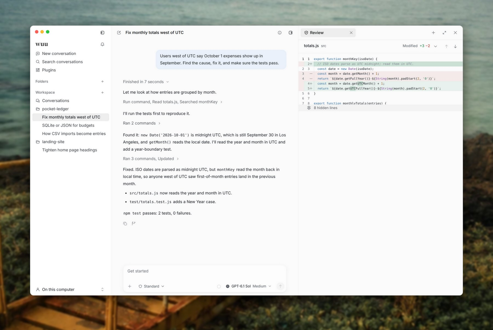
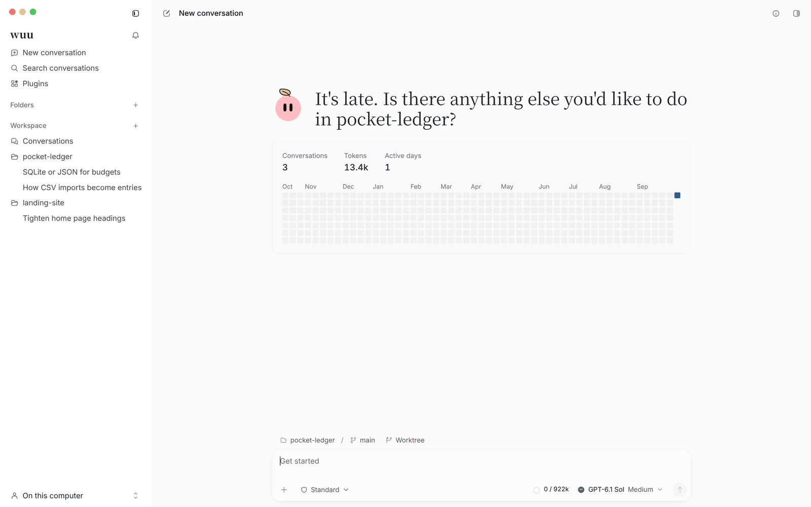
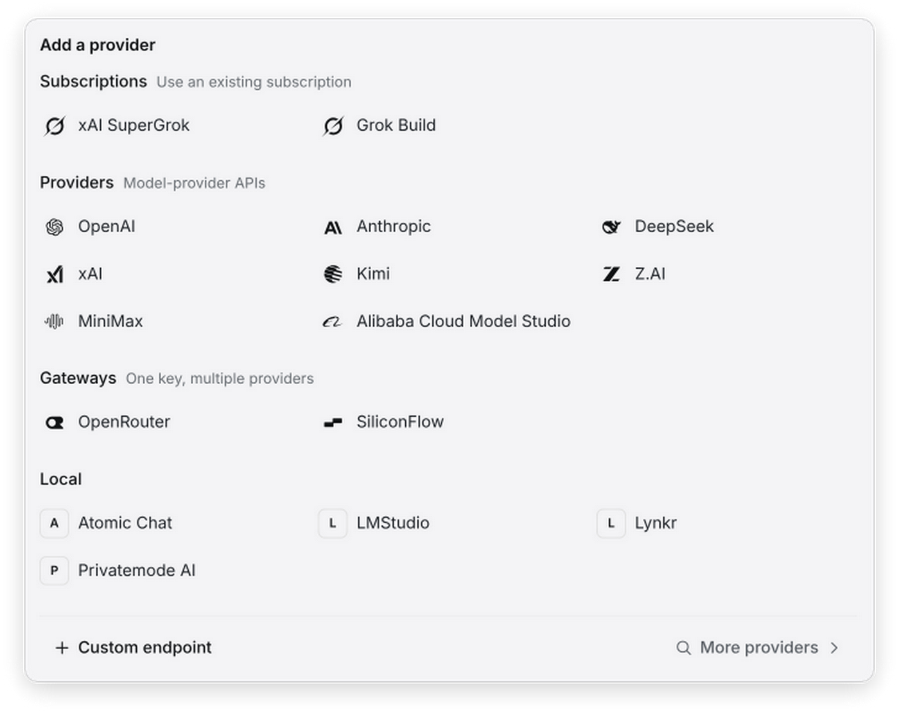
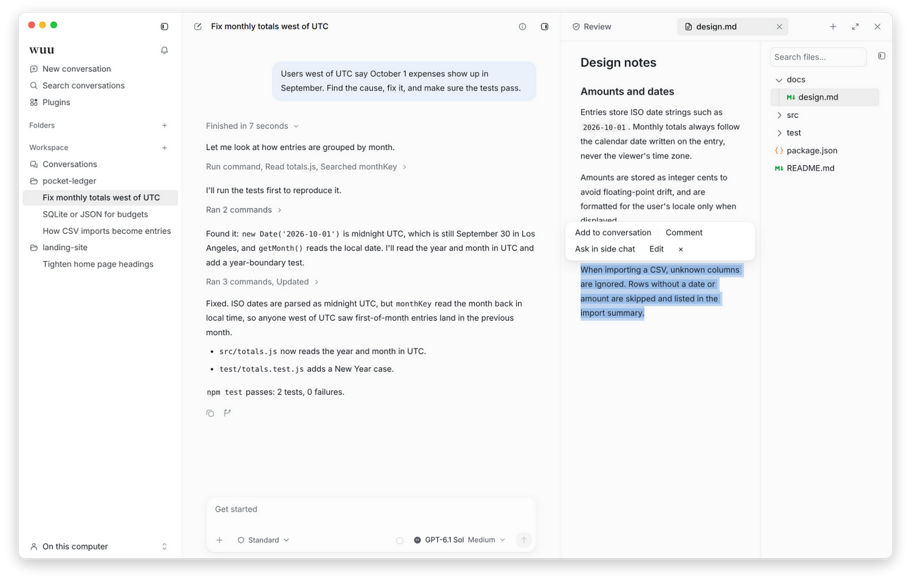
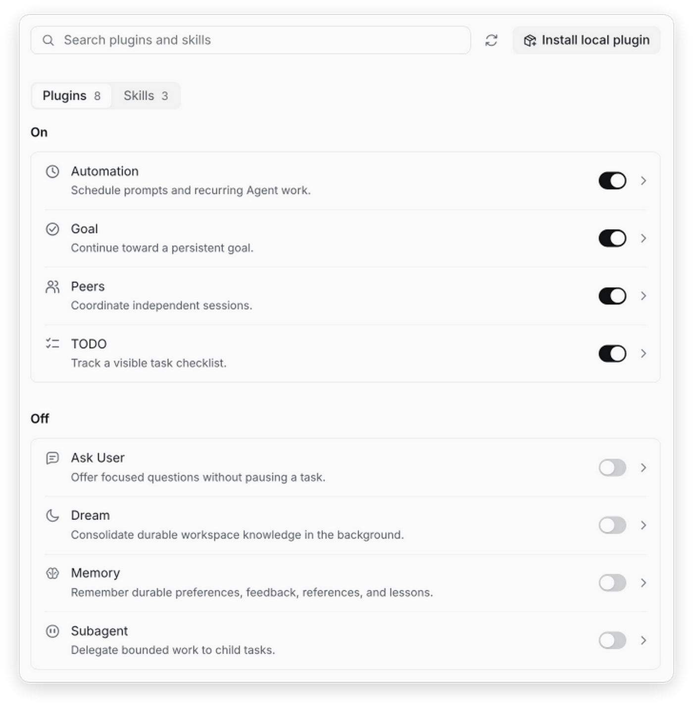

<p align="center">
  
</p>

<h1 align="center">wuu</h1>

<p align="center">
  An open-source desktop app where AI agents work on your local projects,<br>
  and every file they read, command they run and line they change stays in view.
</p>

<p align="center">
  <a href="https://github.com/blueberrycongee/wuu/releases/latest"><b>Download for Mac</b></a> ·
  <a href="https://blueberrycongee.github.io/wuu/en/">Documentation</a> ·
  <a href="README_zh.md">简体中文</a>
</p>

<picture>
  <source media="(prefers-color-scheme: dark)" srcset="landing/assets/readme/hero-dark-en.jpg">
  
</picture>

Point wuu at a folder, describe the task, and let an agent read the code, run commands and edit files. The conversation shows each step as it happens. Beside it, Review shows the actual diff on disk, so you check the result rather than taking the summary on trust.

## See it in action



A user reports that October 1 expenses land in September. The agent searches the code, runs the tests to reproduce the bug, fixes the month calculation and adds a test. One click opens the change in Review.

## Agent benchmark

In the 18-task Terminal-Bench 4 subset reported in [PR #630](https://github.com/blueberrycongee/wuu/pull/630), Wuu matched Codex's pass rate at **11.0% lower recorded API cost**, and solved one more task than Pi at **6.6% lower cost**.

| Harness | Passed | Pass rate | Recorded API cost (USD) | Cost per success (USD) |
| --- | ---: | ---: | ---: | ---: |
| **Wuu** | **10/18** | **55.6%** | **$32.40** | **$3.24** |
| Codex (Code Mode) | 10/18 | 55.6% | $36.42 | $3.64 |
| Pi | 9/18 | 50.0% | $34.68 | $3.85 |

All three harnesses used GPT-6 Astra with high reasoning effort: 18 tasks each, 54 runs total, with skills, memory, ask-user and subagents disabled. Codex 0.150.1 and Pi 0.84.4 retained their native prompts. Codex enabled Code Mode (`code_mode=true`, `code_mode_only=true`); Wuu exposed direct tools alongside optional Code Mode composition. Costs include cached input and exclude title generation; cost per success is total recorded API cost divided by passed tasks. These results cover this subset and configuration, not the full benchmark.

## What's in the preview

### Bring your own model

Connect OpenAI, Anthropic, DeepSeek, xAI, Kimi, Z.AI, MiniMax or Alibaba Cloud Model Studio with an API key. Gateways such as OpenRouter and SiliconFlow and local servers such as LM Studio work too, as does any custom OpenAI- or Anthropic-compatible endpoint. You can also reuse a subscription you already have: a Codex login, xAI SuperGrok or Grok Build.

Already use another coding agent? wuu can run Claude Code, Codex, Cursor, Devin, Grok, Hermes, OpenCode, Pi or Antigravity as the conversation's engine, with that agent's own login and tools. **Settings → Subscriptions** shows plan quotas and balances for every account in one place.

<p align="center">
  
</p>

### Keep the work in view

The workspace panel sits beside the conversation:

- **Review** shows the current Git diff, file by file.
- **Files** previews code, Markdown, images and documents.
- **Terminal** opens a shell in the project.
- **Browser** is the same page the agent drives. A floating preview follows its clicks, and clicking or typing on the page yourself pauses the task.

Select text in a file to add it to the conversation, leave a comment, ask about it in a side chat, or have the agent edit just that passage. Responses work the same way: quote a passage into your next message.

<p align="center">
  
</p>

### Steer without starting over

Press Enter while a task runs to steer it, or Command + Enter to queue the next message. Fork from any earlier message into the same folder or a new Git worktree. Start a conversation in its own worktree so experiments stay off your branch. Use `/side` for a quick question that stays out of the main thread, and search to find any past conversation.

### Decide how far the agent can reach

Pick a permission mode for each conversation. **Read-only** is for investigation. **Standard** allows edits inside the workspace. **Unconfined** lifts the boundary when you really need it. In Read-only and Standard, the agent's commands run inside the macOS Seatbelt sandbox. Turn on **Approve for me** to have the model review shell commands and risky actions before they run.

When the work belongs somewhere else, run the agent's tools in Docker, over SSH, in Singularity/Apptainer, or in a Modal, Daytona or Vercel sandbox.

### Make it yours

Plugins add tools and features: scheduled automation, persistent goals, task checklists, memory, subagents and more. Each one can be turned on or off. You can install a local plugin, add skills, connect MCP servers and run hooks. Extensions use the same public API as the bundled plugins. See [Extend wuu](docs/en/customize/index.md).

<p align="center">
  
</p>

## Get started

The desktop preview runs on Apple silicon Macs. Download it from [GitHub Releases](https://github.com/blueberrycongee/wuu/releases/latest), move `wuu.app` to `/Applications`, and open it.

The preview is unsigned. It has ad-hoc signatures only, with no Apple Developer ID or notarization. If macOS blocks it, follow the [installation guide](docs/en/getting-started/installation.md).

On first launch, connect a model service and add a project folder as a workspace. Start with a small task, then check the changes and test results in Review. The [quick start](docs/en/getting-started/index.md) walks through an example.

## Command line

The desktop app includes its own core. To use wuu from a terminal or script as well, install the Go version listed in [go.mod](go.mod) and build the CLI:

```bash
git clone https://github.com/blueberrycongee/wuu.git
cd wuu
make install
wuu init
```

Make sure Go's binary directory is on your `PATH`, and [configure a model provider](docs/en/getting-started/model-services.md#configure-the-cli). Then run a task:

```bash
cd /path/to/your/project
wuu exec --permission-mode read_only "review this project and explain how to run its tests"
```

The [`wuu exec` guide](docs/en/automation/exec.md) covers scripting, JSONL output and session controls.

## Your files and data

wuu reads and changes local files and runs commands within the active permission mode. Prompts and relevant context go to the model provider you choose. Sessions and settings are stored under `~/.wuu` by default. Read the [security model](docs/en/reference/security-model.md) before working with sensitive data or untrusted projects.

## Contribute

See [Contributing](CONTRIBUTING.md) to work on wuu, or [open an issue](https://github.com/blueberrycongee/wuu/issues) to report a problem. Report security vulnerabilities through [SECURITY.md](SECURITY.md).

## Acknowledgements

Thanks to [@Rosemary1812](https://github.com/Rosemary1812) for contributing to Fusion's multi-agent collaboration, including Lead/Sidekick collaboration design, user experience, and behavioral testing ([#489](https://github.com/blueberrycongee/wuu/pull/489)).

Licensed under [MIT](LICENSE). Agent avatars use [blobatar](https://github.com/Alain00/blobatar), also MIT-licensed. The screenshots above come from the real app working on synthetic example projects; [landing/README.md](landing/README.md#readme-media) explains how to regenerate them.
