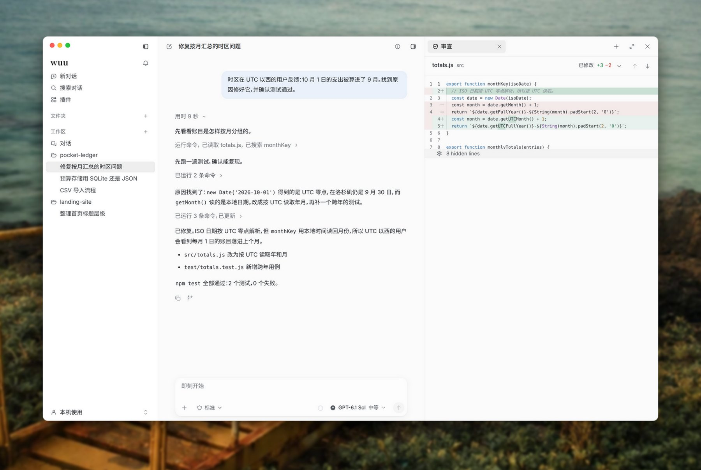
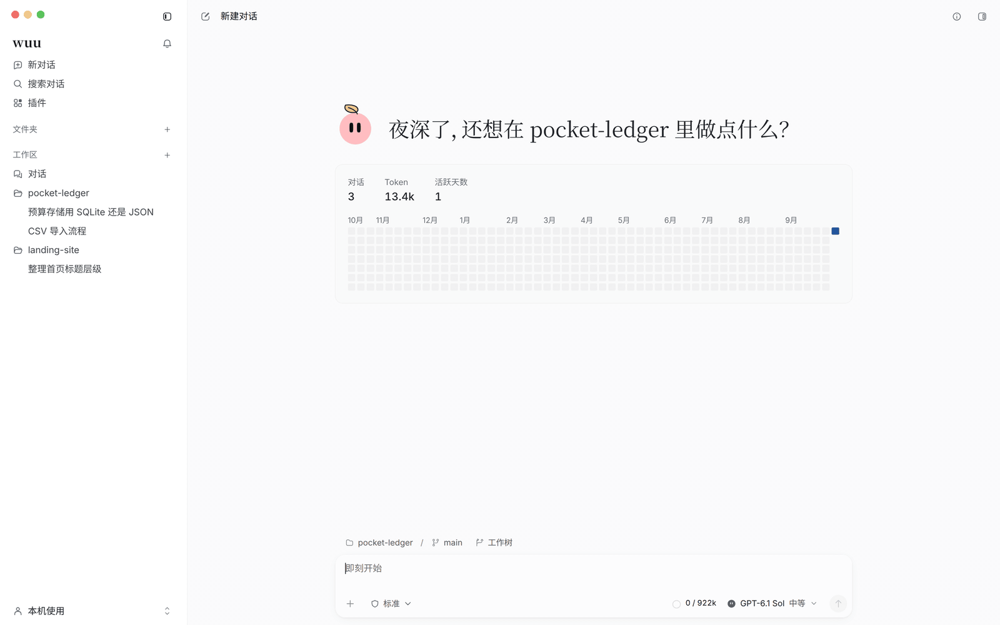
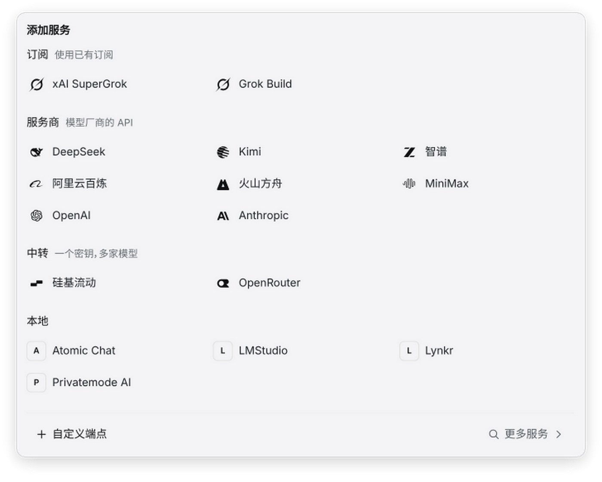
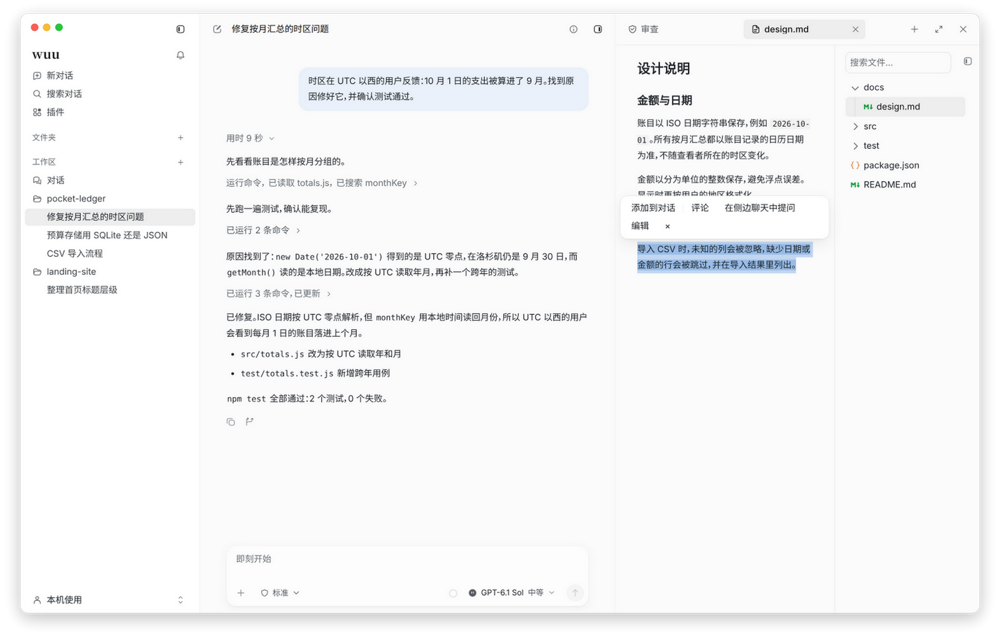
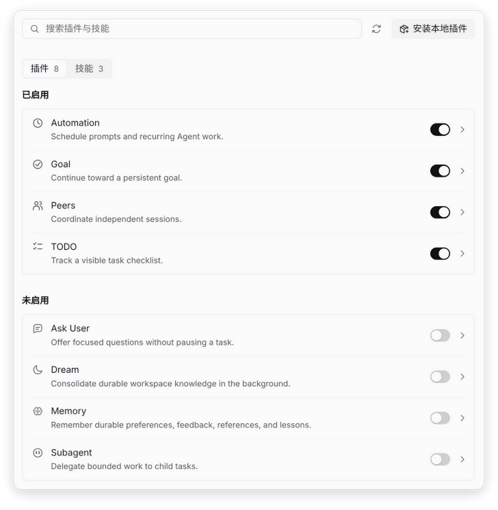

<p align="center">
  
</p>

<h1 align="center">wuu</h1>

<p align="center">
  开源的桌面应用，让 AI Agent 在你的本地项目里干活；<br>
  它读了哪些文件、跑了哪些命令、改了哪几行，都摆在你眼前。
</p>

<p align="center">
  <a href="https://github.com/blueberrycongee/wuu/releases/latest"><b>下载 Mac 版</b></a> ·
  <a href="https://blueberrycongee.github.io/wuu/zh-cn/">文档</a> ·
  <a href="README.md">English</a>
</p>

<picture>
  <source media="(prefers-color-scheme: dark)" srcset="landing/assets/readme/hero-dark-zh.jpg">
  
</picture>

选一个文件夹，说清楚要做什么，Agent 就会去读代码、跑命令、改文件。每一步都实时显示在对话里；旁边的审查面板是磁盘上真实的 diff。结果对不对，你自己看得到，不用只信它的总结。

## 看它怎么干活



用户反馈 10 月 1 日的支出被算进了 9 月。Agent 先搜代码、跑测试复现问题，再修好月份的计算、补上测试。点一下就能在审查面板里看到这次改动。

## Agent 基准测试

在 [PR #630](https://github.com/blueberrycongee/wuu/pull/630) 记录的 Terminal-Bench 4 实验中，三个 Agent 框架各运行了同一组 18 道任务。Wuu 的通过率与 Codex 持平，**记录的 API 总费用低 11.0%**；相比 Pi，Wuu 多通过一道任务，**总费用低 6.6%**。

| Agent 框架 | 通过任务数 | 通过率 | 记录的 API 总费用（美元） | 每个成功任务的成本（美元） |
| --- | ---: | ---: | ---: | ---: |
| **Wuu** | **10/18** | **55.6%** | **$32.40** | **$3.24** |
| Codex（Code Mode） | 10/18 | 55.6% | $36.42 | $3.64 |
| Pi | 9/18 | 50.0% | $34.68 | $3.85 |

三个框架均使用 GPT-6 Astra，推理强度设为 high，每个框架运行 18 道任务，共 54 次运行，并关闭技能、记忆、向用户提问和子 Agent。Codex 0.150.1 与 Pi 0.84.4 保留各自的原生提示词。Codex 开启 Code Mode（`code_mode=true`、`code_mode_only=true`）；Wuu 直接暴露基础工具，同时支持按需用 Code Mode 编排调用。费用包含缓存输入，不包含标题生成；每个成功任务的成本按 API 总费用除以通过任务数计算。

## 预览版能做什么

### 用你自己的模型

用 API Key 接入 DeepSeek、Kimi、智谱、阿里云百炼、火山方舟、MiniMax、OpenAI 或 Anthropic；也可以走硅基流动、OpenRouter 这类中转，或者 LM Studio 这类本地服务，任何兼容 OpenAI 或 Anthropic 接口的自定义端点都能接。已有的订阅也能直接用：Codex 登录、xAI SuperGrok、Grok Build。

已经在用别的编程 Agent？wuu 可以把 Claude Code、Codex、Cursor、Devin、Grok、Hermes、OpenCode、Pi 或 Antigravity 作为对话的引擎，沿用它们自己的登录和工具。**设置 → 订阅** 会把各个账号的额度和余额放在一起显示。

<p align="center">
  
</p>

### 过程和结果都看得见

工作区面板就在对话旁边：

- **审查**：按文件查看当前的 Git diff。
- **文件**：预览代码、Markdown、图片和文档。
- **终端**：在项目目录里打开一个 shell。
- **浏览器**：就是 Agent 正在操作的那个页面。悬浮预览会跟着它的点击移动；你自己在页面上点击或输入，任务就会暂停。

在文件里选中一段文字，可以把它添加到对话、写一条批注、在侧边聊天中提问，或者让 Agent 只改这一段。Agent 的回复也一样，选中一段就能引用到下一条消息里。

<p align="center">
  
</p>

### 随时调整方向

任务运行时按 Enter 可以插话调整方向，按 Command + Enter 则把消息排到下一轮。可以从任意一条历史消息分叉，分到原来的文件夹或新的 Git worktree。新对话也可以直接开在独立的 worktree 里，试验不会碰到你当前的分支。临时想问点什么就用 `/side`，不打扰主对话；以前的对话都能搜索。

### Agent 能碰到哪里，由你决定

每个对话都可以单独选权限模式：**只读** 用来调查，**标准** 允许在工作区内修改，**无边界** 留给确实需要的时候。在只读和标准模式下，Agent 运行的命令处在 macOS Seatbelt 沙箱里。打开 **替我审批** 后，shell 命令和高风险操作执行前会先交给模型审查。

如果任务应该在别处跑，可以把 Agent 的工具放进 Docker、通过 SSH 连到远程机器、使用 Singularity/Apptainer，或者在 Modal、Daytona、Vercel 的沙箱里运行。

### 按你的方式扩展

插件可以添加工具和功能，比如定时自动化、长期目标、任务清单、记忆、子 Agent 等，每一个都能单独开关。你还可以安装本地插件、添加技能、连接 MCP 服务、配置 hooks。扩展和内置插件用的是同一套公开 API。详见[扩展 Wuu](docs/zh-cn/customize/index.md)。

<p align="center">
  
</p>

## 开始使用

桌面预览版支持 Apple 芯片的 Mac。从 [GitHub Releases](https://github.com/blueberrycongee/wuu/releases/latest) 下载，把 `wuu.app` 放进 `/Applications` 后打开。

预览版没有正式签名：只有 ad-hoc 签名，没有 Apple Developer ID，也没有经过公证。如果 macOS 阻止打开，请按[安装指南](docs/zh-cn/getting-started/installation.md)处理。

第一次打开时，先接上模型服务，再把项目文件夹添加为工作区。可以从一个小任务开始，完成后在审查面板里检查改动和测试结果。[快速开始](docs/zh-cn/getting-started/index.md)里有完整的示例。

## 命令行

桌面应用自带运行所需的核心。如果还想在终端或脚本里用 wuu，先安装 [go.mod](go.mod) 要求的 Go 版本，再构建 CLI：

```bash
git clone https://github.com/blueberrycongee/wuu.git
cd wuu
make install
wuu init
```

确认 Go 的二进制目录在 `PATH` 中，并[配置模型服务](docs/zh-cn/getting-started/model-services.md#配置-cli)，然后运行一个任务：

```bash
cd /path/to/your/project
wuu exec --permission-mode read_only "阅读这个项目，告诉我怎样运行测试"
```

脚本调用、JSONL 输出和会话控制见 [`wuu exec` 指南](docs/zh-cn/automation/exec.md)。

## 文件与数据

wuu 会在当前权限模式允许的范围内读写本地文件、运行命令。你的消息和相关上下文会发送给你选择的模型服务，会话和设置默认保存在 `~/.wuu`。处理敏感资料或不可信的项目之前，请先阅读[安全模型](docs/zh-cn/reference/security-model.md)。

## 参与项目

开发相关说明见[贡献指南](CONTRIBUTING.md)。遇到问题可以[提交 issue](https://github.com/blueberrycongee/wuu/issues)；安全漏洞请按 [SECURITY.md](SECURITY.md) 报告。

## 致谢

感谢 [@Rosemary1812](https://github.com/Rosemary1812) 为 Fusion 多 Agent 协作功能作出的贡献，包括 Lead/Sidekick 协作设计、交互体验和行为测试（[#489](https://github.com/blueberrycongee/wuu/pull/489)）。

项目采用 [MIT 许可证](LICENSE)。Agent 头像使用同为 MIT 许可的 [blobatar](https://github.com/Alain00/blobatar)。上面的截图来自真实应用，处理的是虚构的示例项目；重新生成的方法见 [landing/README.md](landing/README.md#readme-media)。
