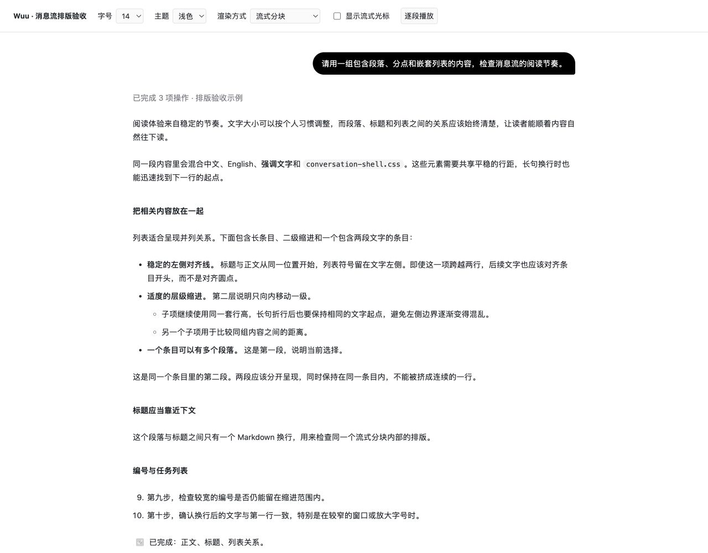
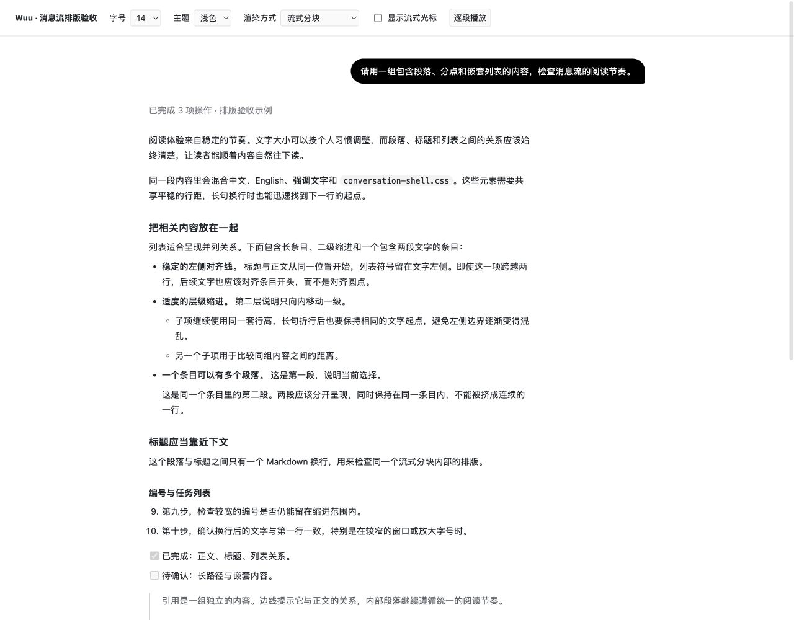
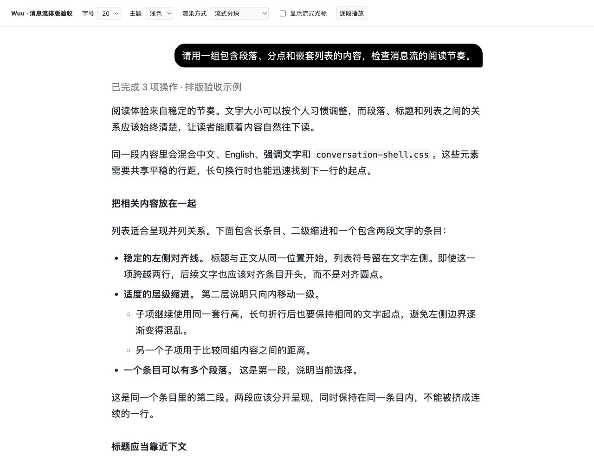
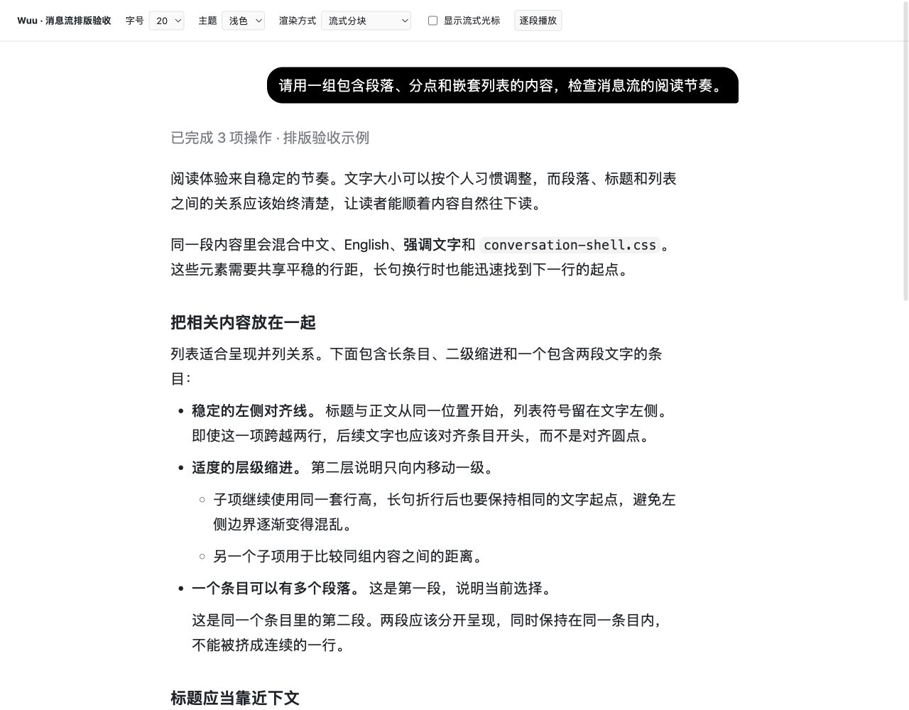
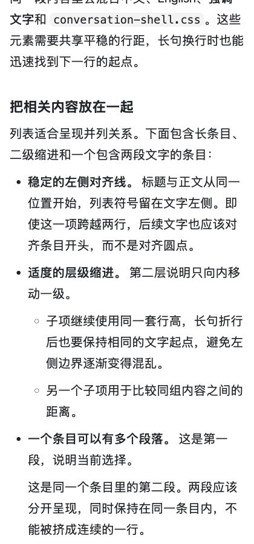

# 消息流排版改动与视觉验收

2026-09-10。已修改产品代码，保留现有 13–20px 字号设置与 14px 默认值。

> 提交前核对：当前代码的 `--conversation-prose-max-width` 为 `100%`，正文与消息/输入框共用栏宽，不再单独限制为 616px / 720px。本次保留当前代码；下文的窄栏测量、截图和视觉结论记录的是此前验收版本，不代表本次提交的最终栏宽效果。提交前重新运行 RichContent 与 StreamingMarkdown 回归，82 项通过；未重新进行视觉验收。

> 提交范围验证：从 Git 暂存区导出独立的 desktop / packages 快照，排除未提交的内嵌可视化改动后，`npm run typecheck` 与上述 82 项回归均通过。这不代表包含其他未提交改动的整个工作区已通过类型检查。

## 参考页

[OpenAI 原文](https://openai.com/index/introducing-chatgpt-images-2-5/)使用 OpenAI Sans / OpenAI Sans Variable Scripts 字体栈。1280px 浏览器下测得正文 17px、行高约 28px、字距 −0.17px，正文文字区域约 588px。它体现的是自有字体、响应式阅读栏和分角色间距的组合；未查到该页面公开声明的独立排版系统名称。

Wuu 继续使用用户选择的字体，中文保持自然字距。此次借鉴行宽与垂直节奏的组织方式，没有引入 OpenAI 字体资源。

## 已完成的改动

- 段距、标题前后间距和列表间距随消息字号变化。标题距下文小于距上文，介绍句与其列表保持邻近。
- 一级列表文字缩进约 1.5 倍字号，二级再增加一级；深层列表收敛缩进。多行条目使用悬挂缩进，任务勾选框跟随字号并占用符号区域。
- 修复流式分块把列表内的空行误当作列表结束的问题，保留多段落条目、嵌套列表和连续编号。新增回归覆盖 CRLF、空白行、制表符、列表内代码块和逐步到达的内容。
- 列表内段落恢复块级布局，引用内段落也有明确段距。
- 正文阅读宽度随字号变化，上限 720px；代码与表格继续使用原来的 800px 外层宽度。小标题提供克制的字号层级。
- 过程行高从固定 20px 改为 1.6 倍字号。消息正文保持 1.75 倍行高，过程叙述继承自己的行高。
- 普通 Markdown、流式分块内部及跨分块的相邻内容使用同一套规则。样式限定在消息容器中，文件预览保留自己的标题尺度。

## 同一组内容的浏览器测量

| 项目 | 14px 改动前 | 14px 改动后 | 20px 改动前 | 20px 改动后 |
| --- | ---: | ---: | ---: | ---: |
| 正文宽度 | 800px | 616px | 800px | 720px |
| 正文段距 | 24px | 16.09px | 24px | 23px |
| 标题到下文 | 24px | 7px | 24px | 10px |
| 一级列表文字缩进 | 26px | 20.99px | 26px | 30px |
| 过程行高 | 20px | 22.4px | 20px | 32px |

小数差异来自浏览器的布局精度。分点第二段现在保留在原条目内；对应样例的四个列表段落均在正确的 li 中。

## 视觉与行为验收

验收页直接加载生产 `RichContent`、`StreamingMarkdown`、字号应用函数和完整样式，不是重画的静态样稿。

- 1280px 桌面：同文比较 14px、20px 的改动前后截图。
- 420px 窄窗：检查 13px、20px 下的换行、嵌套列表与长路径；页面宽度没有超过视口。
- 320px 深色：以字号上限 20px 检查列表；页面宽度为 320px，没有横向溢出。
- 普通 Markdown 与流式分块：14px、20px 下对应内容块的纵向位置差为 0px。
- 流式光标开启/关闭：20px 下对应内容块的位置及高度差为 0px。
- 实际逐段向流式存储写入完整样例：最终 16 个内容块与一次性渲染的位置及高度差为 0px，多段落条目结构正确。
- 检查聊天气泡与文件预览，字号设置有效；文件预览维持独立标题比例。

范围说明：上述视觉比较是在开发服务器中渲染真实消息组件。Wuu Dev 进程及其开发服务器仍在运行，但本次原生窗口截图接口返回“截图不可用”，因此没有宣称完成原生窗口整屏的视觉验收。实际截图均来自浏览器中的组件验收页。

## 验证命令

- `vitest`：RichContent、StreamingMarkdown、MessageFlowFontSizeSection、AppearancePreferences、ThreadItemView、WorkspaceFiles 相关测试通过；最后复查 RichContent + StreamingMarkdown 共 82 项通过，其中 StreamingMarkdown 46 项。
- `npm run typecheck`：本次排版改动完成后通过。随后工作区并行出现内嵌可视化功能改动，最终全量复查在 `remarkInlineVisualization.ts` 报出三处类型错误：自定义 `wuuVisualization` 节点类型，以及 `micromarkExtensions`、`fromMarkdownExtensions` 的 Data 类型声明。这部分不是本次排版改动，已保留并明确记录，当前不宣称全工作区类型检查通过。
- `npm run build`：在上述并行改动出现之前，移动网页版、Electron 主进程、preload 与 renderer 构建通过。
- `git diff --check`：通过。

开发服务运行时可打开 [真实组件验收页](http://localhost:5173/dev/message-flow-reading/)，切换字号、主题、渲染方式并播放流式内容。该入口只用于开发，不进入正式构建入口。

## 截图

14px 改动前：

14px 改动后：

20px 改动前：

20px 改动后：

420px 窄窗、20px 列表：

320px 深色、20px 列表：

