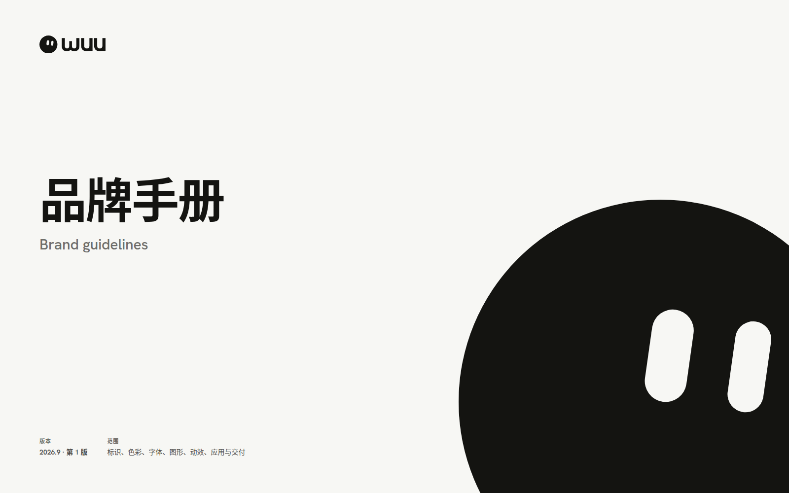
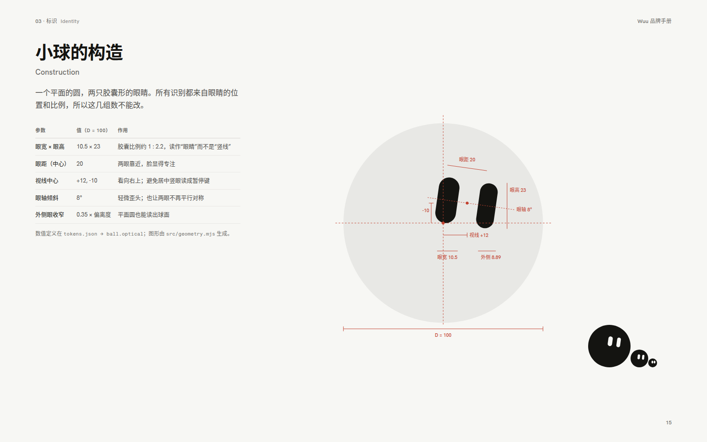
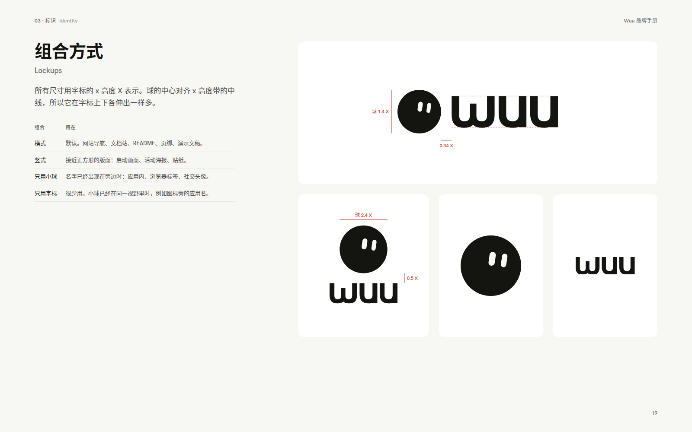
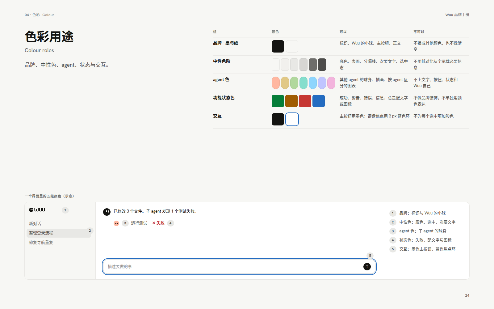
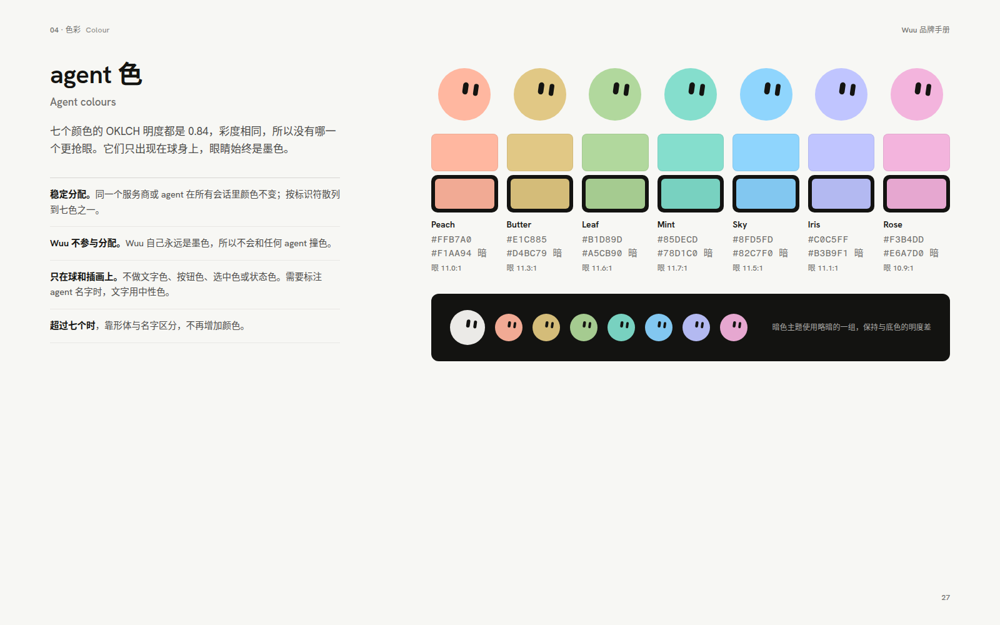
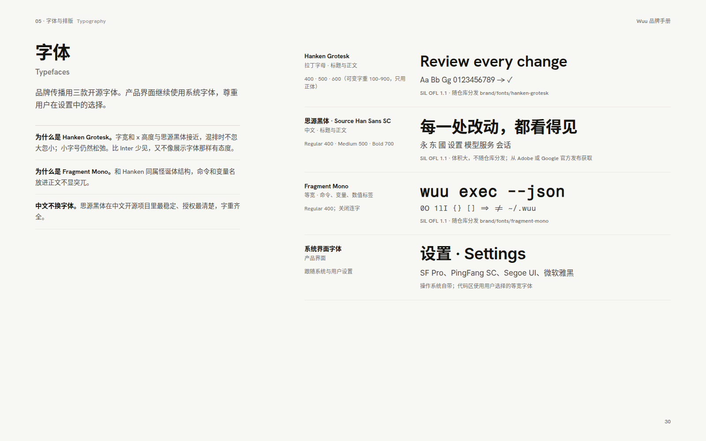
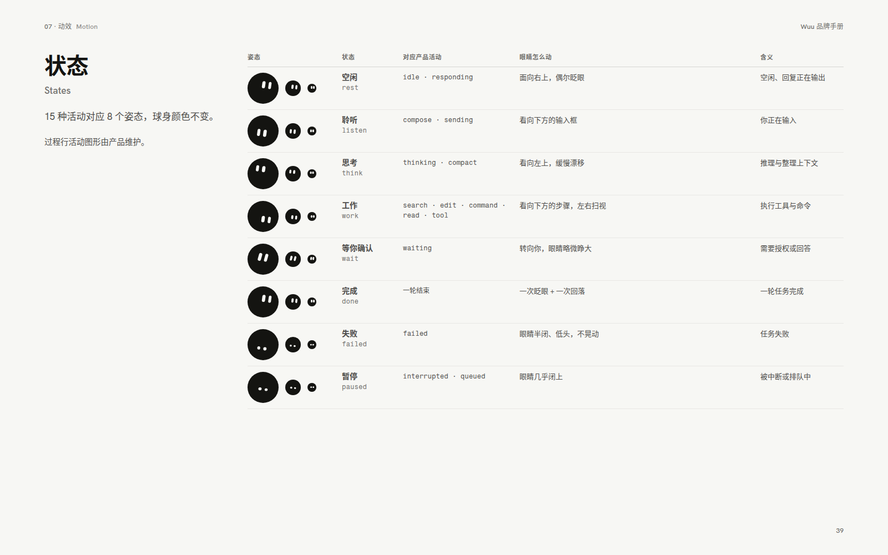
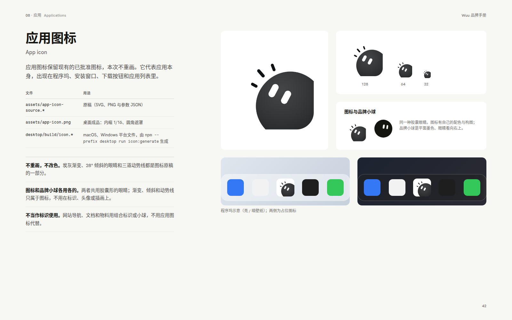
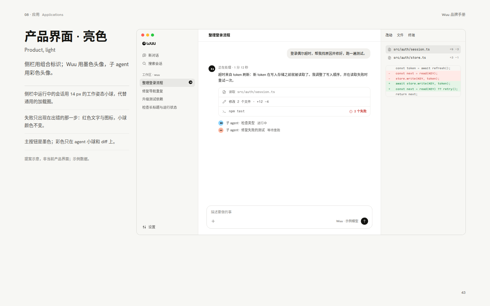
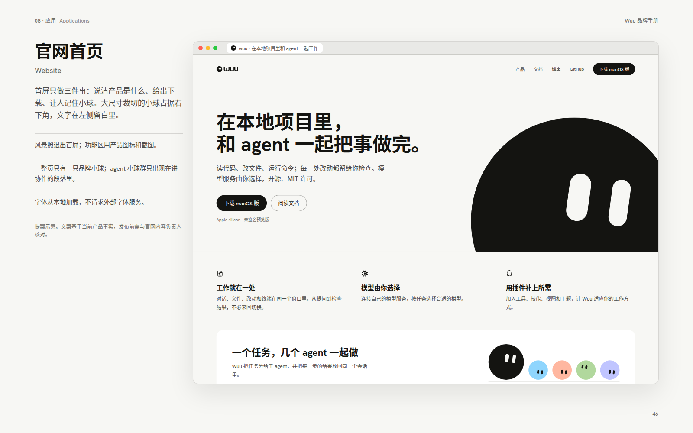

# Wuu brand guidelines

Wuu's brand is ink and paper with one character: the ball. Its eyes carry all of its identity and state. Other agents and models appear as the same ball in seven agent colours; Wuu itself is always ink. The complete manual is [`brand/manual/index.html`](../../../brand/manual/index.html) (open it in a browser; written in Chinese). Its sources, assets and generators are in [`brand/`](../../../brand/README.md).

These guidelines define the identity and show proposed applications. They do not change the desktop app, the website or this documentation site; adopting them there is separate work.

## The ball

| Use | Colour | Eyes |
| --- | --- | --- |
| Brand symbol: logo, website, documentation, materials | Ink (paper on dark grounds) | Fixed brand pose, looking up and to the right |
| Wuu at work: its own avatar in a conversation | Ink (paper in dark theme) | Follow the activity state |
| Other agents: subagents, project agents, models, providers | One of seven agent colours | Follow the activity state; ink eyes |

- The eyes never sit centred and upright: two upright capsules on a disc read as a pause button. The offset gaze is what makes it a face.
- Use the optical size that matches the rendered diameter: display above 40 px, small from 21 to 40 px, micro at 20 px and below (each micro eye lands on whole pixels at 16 px).
- The ball is not a mascot, a generic loading indicator or a decoration. A layout holds at most one brand ball; a group of agent balls is the exception.
- Do not add a mouth, blush, limbs, gradients, highlights, shadows or outlines, and do not put product accessories on the brand symbol.

## Wordmark and lockups

The wordmark "wuu" is drawn from one bowl: the w is two bowls sharing a shorter, lighter middle stem; each u is the same bowl with a flat spur. Use only the supplied files; never retype it in a font. In prose, write **Wuu** in both languages and `wuu` for the command.

Lockup dimensions are multiples of the wordmark x-height X. The horizontal lockup is the default (ball 1.4 X, gap 0.34 X); the stacked lockup suits square formats. Keep 1 X of clear space around lockups and 0.25 D around the symbol. The horizontal lockup has a minimum x-height of 7 px on screen and a minimum width of 14 mm in print; the symbol has a minimum of 12 px and 4 mm.

## Colour

Each colour group has one job:

| Group | Tells you | Used for | Never for |
| --- | --- | --- | --- |
| Ink `#141411` and paper `#F7F7F4` | This is Wuu | Logo, Wuu's ball, primary buttons, body text | Other hues or gradients |
| Stone neutrals | Content structure | Grounds, surfaces, lines, secondary text, selection | Essential information in low-contrast grey |
| Agent colours | Which agent | Other agents' balls, illustration, per-agent charts | Text, controls, status, Wuu itself |
| Status colours | What happened | Success, warning, danger, info, always with text or an icon | Decoration |
| Interaction | You can act here | Ink primary button, 2 px blue focus ring | Colouring every selected item |

Neutrals are chosen by contrast against the ground, not by even steps: body text 17.2 : 1, secondary 8 : 1, tertiary 4.8 : 1, placeholder 3 : 1. Agent colours share OKLCH lightness 0.84, so none is louder; status colours are darker and saturated, so the two never read as each other. When an agent fails, its ball keeps its colour; the failure is carried by its eyes, red text and an icon.

## Typography

| Face | Role | Licence |
| --- | --- | --- |
| Hanken Grotesk | Latin headlines and text in brand communication | SIL OFL 1.1, bundled in `brand/fonts/` |
| Source Han Sans SC / Noto Sans CJK SC | Chinese | SIL OFL 1.1, install from the official releases |
| Fragment Mono | Commands, paths and variable names; ligatures off | SIL OFL 1.1, bundled in `brand/fonts/` |
| System UI font | The product interface, following user settings | Operating system |

Put a space between Chinese and Latin text and between numbers and units. Use full-width punctuation in Chinese sentences, monospace for commands and paths, and weight rather than italics for emphasis.

## Motion

The eyes move first; the body barely moves. Motion reuses the product's durations and its ease-out and ease-in curves.

| Motion | Timing | When |
| --- | --- | --- |
| Gaze change | 180 ms, ease-out | A state changes |
| Blink | 60 + 40 + 90 ms, every 3.8–8.2 s | Rest, listening, needs you |
| Settle | 280 ms, squash at most 6 % | Once, when a turn completes |
| Working drift | 1600 ms period | Only while thinking or working |

The product's 15 activities map to eight poses: rest, listen, think, work, wait, done, failed and paused. With reduced motion, from the system or from the app's Motion setting, states switch directly to their final pose, with no blinks, settles or loops; the pose and the accompanying text still carry the state. The reference implementation and a demo are in [`brand/assets/motion/`](../../../brand/assets/motion/wuu-ball.js).

## Applications

The app icon keeps its approved artwork in `assets/app-icon-source.*`; the brand does not redraw it. Its charcoal gradient, 28° eyes and motion marks belong to the icon only: do not carry them into the logo, avatars or illustrations, and do not use the app icon in place of the logo. At large formats (covers, website heroes, social images) the ball may be cropped by one or two edges if both eyes stay fully visible and text never overlaps it.

## Maintenance

Every value is defined once, in `brand/tokens/tokens.json`. Change it there, run `npm --prefix brand run build` and `npm --prefix brand run render` (see [`brand/README.md`](../../../brand/README.md)), and review the regenerated manual and previews. Do not edit exported files. The product's own design foundations remain in [the design system](design-system.md); product tokens change only through that process.

Not yet verified: trademark availability, user research, whether the app icon needs a variant below 32 px, print colours, rendering on Windows and macOS, and colour-vision simulation of the agent colours.
