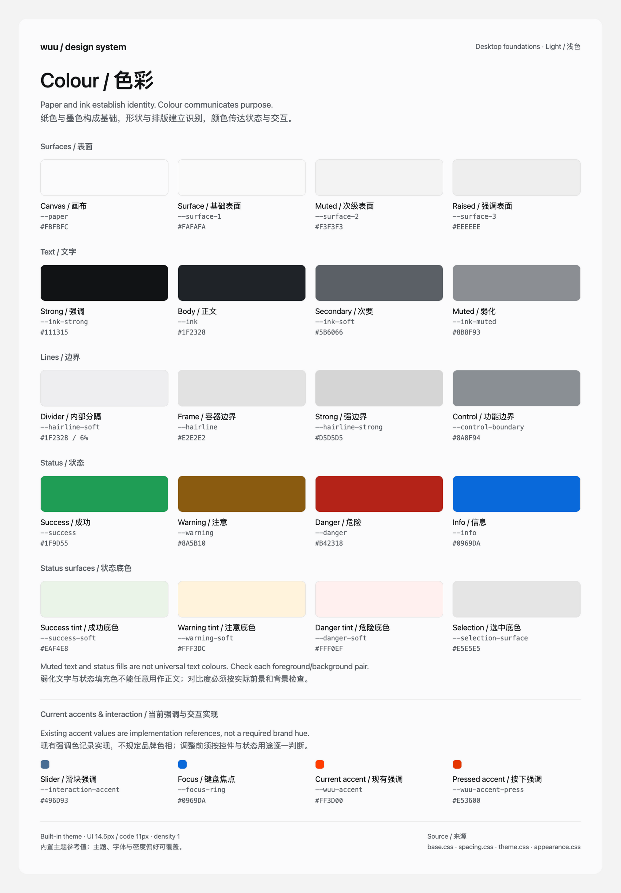
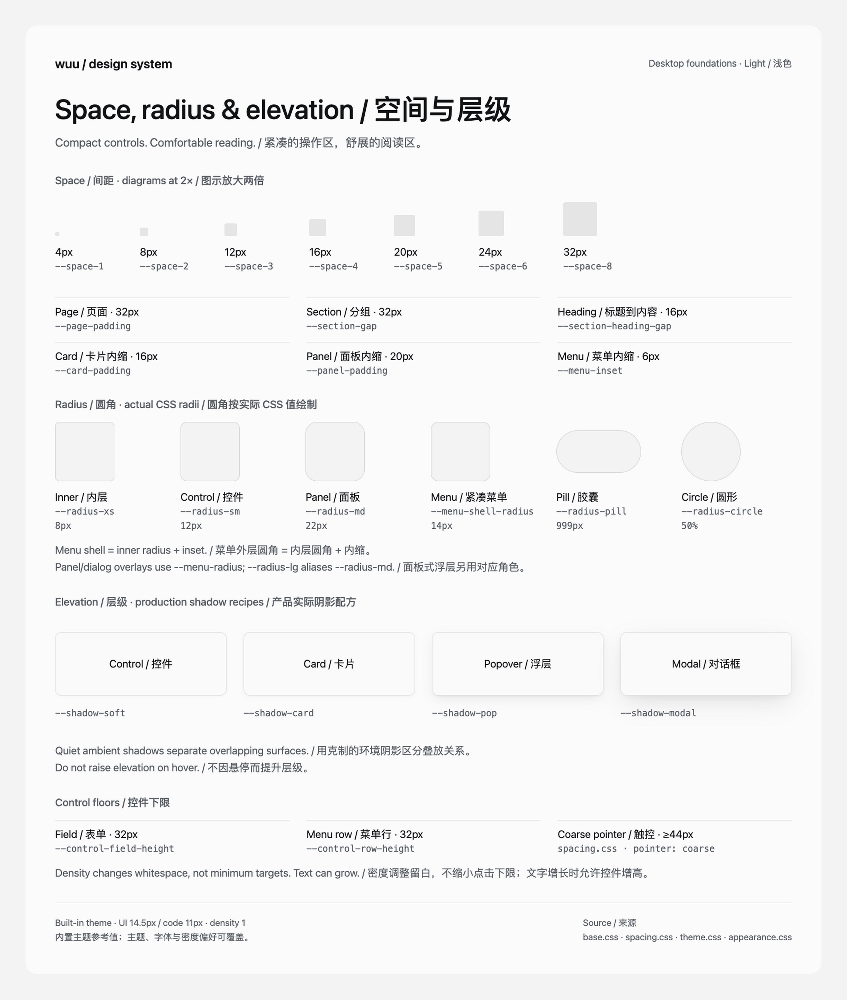
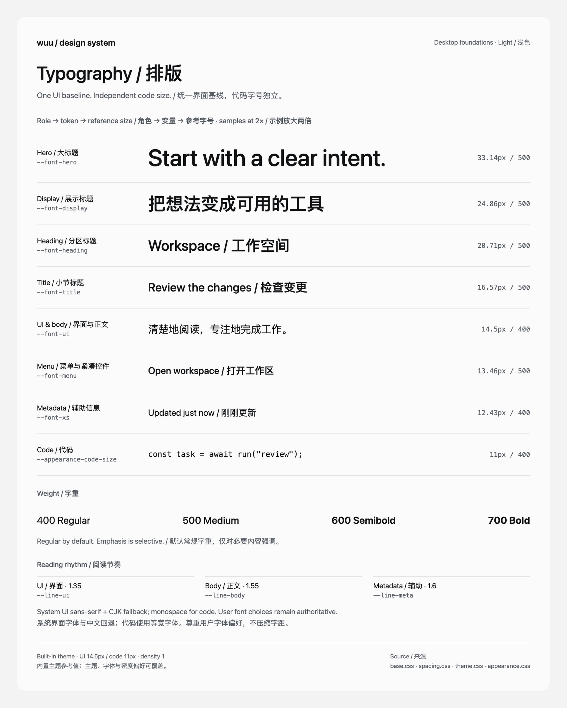

# Wuu 设计系统

Wuu 的界面以长时间阅读与高频操作为中心：以纸色与墨色构成基础，用形状和排版建立识别，用颜色传达状态与必要的交互提示。优先用位置、留白、字号和字重建立层级，再按需要加入边界与阴影。

这份规范与配套图版共同维护桌面端的设计基础，供设计、开发和 AI 编码使用。它不是产品换肤方案，也不表示现有每个界面都已符合规范。原生手机端遵循相同的信息与交互原则，但不直接照搬桌面的像素尺寸。

## 图版

图版按「色彩」「间距、圆角与层级」「排版」组织，使用 Wuu 的实际变量，不采用外部参考图的配色或字体。每类提供浅色和深色两张高清 PNG，中英文标注共用一份资产。

| 图版 | 浅色 | 深色 |
| --- | --- | --- |
| 色彩 | [查看原图](../../en/assets/design-system/colour-light.png) | [查看原图](../../en/assets/design-system/colour-dark.png) |
| 间距、圆角与层级 | [查看原图](../../en/assets/design-system/geometry-light.png) | [查看原图](../../en/assets/design-system/geometry-dark.png) |
| 排版 | [查看原图](../../en/assets/design-system/type-light.png) | [查看原图](../../en/assets/design-system/type-dark.png) |







图版展示内置主题、标准密度与当前默认字体设置。色值来自浏览器计算结果；透明色标出不透明度，必须结合所在背景理解。文字示例和间距方块放大两倍以便观察，旁边标注的是实际 CSS 尺寸，不是图片像素。图版自身的标题、边距和画布不构成产品 token。

## 规范与实现的关系

**用角色，不复制图中的数值。** Token（设计变量）是有明确用途的命名值，例如 `--ink-soft` 表示次要文字；组件通过 `var(...)` 使用它。主题或用户偏好可以改变最终数值，但不应改变该角色的含义。

| 来源 | 负责内容 |
| --- | --- |
| [base.css](../../../desktop/src/renderer/styles/base.css) | 颜色角色、浅色默认值、圆角、阴影、字重与动效 |
| [theme.css](../../../desktop/src/renderer/styles/theme.css) | 深色覆盖，包括文字、表面和阴影配方 |
| [spacing.css](../../../desktop/src/renderer/styles/spacing.css) | 间距角色、密度边界、窄屏内缩与触控尺寸下限 |
| [appearance.css](../../../desktop/src/renderer/styles/appearance.css) | 实际 UI 字号比例、独立代码字号与图标尺寸 |
| [AppearancePreferences.ts](../../../desktop/src/renderer/AppearancePreferences.ts)、[protocol](../../../packages/protocol/src/index.ts) | 字体、字号偏好与运行时默认值 |
| [共享组件与预览](desktop-ui.md) | 控件行为、键盘操作、真实状态与验收入口 |

这些是内部 renderer 角色，不是全部对外承诺的 API。扩展作者使用[公开主题契约](../customize/theme-surface-matrix.md)，不要把内部变量当成稳定扩展接口。文档描述用途，代码定义数值，图版是代码的可再生视图；三者发生差异时先核实实际级联和用户设置，再同步修正，不能只改图上的标签。

## 色彩

### 品牌识别与强调

Wuu 以黑白与中性色为品牌基础，不强制指定一种标志性色相。黑白应用图标、统一的形状、排版和留白共同建立识别。中性不意味着把界面铺成一片灰：通过清晰的明暗对比和信息层级保持可读，浅色与深色主题表达相同的角色。

品牌识别、操作强调和状态表达是三件不同的事。主要操作可以通过前景与背景的强对比突出，不必使用高饱和品牌色填充。链接、键盘焦点和选中需要明确的交互提示；成功、警告和危险需要不同的含义。颜色服务于这些用途，不为每个标题或选中项增加装饰。必要的区别不能只依赖颜色。

### 颜色角色

| 角色 | 变量 | 使用规则 |
| --- | --- | --- |
| 画布与表面 | `--paper`、`--surface-1` 至 `--surface-4` | 区分底层、次级和强调表面；表面编号不等于阴影高度 |
| 文字 | `--ink-strong`、`--ink`、`--ink-soft` | 重要信息、正文、次要说明；正文保持易读，不把所有文字加粗 |
| 弱化文字 | `--ink-tertiary`、`--ink-muted`、`--ink-faint` | 依用途选择；不能用弱对比解决布局拥挤，必要信息不依赖最浅一档 |
| 三档线条 | `--hairline-soft`、`--hairline`、`--hairline-strong` | 同一表面内分隔、独立容器边界、较强控件边界；不为每条线创建灰色 |
| 功能边界与焦点 | `--control-boundary`、`--focus-ring` | 表达可操作边界和键盘焦点，与装饰分隔线区分 |
| 选中 | `--selection-surface` | 使用明确的选中底色，不借用警告或成功色 |
| 状态 | `--success`、`--warning`、`--danger`、`--info` | 成功、注意、危险和信息；配合文字或图标，不只靠颜色区分 |

成功、警告和危险的轻底色分别为 `--success-soft`、`--warning-soft`、`--danger-soft`。状态色不是通用正文色，也不保证在任意填充背景上可读。彩色填充上的文字使用适用的 `--ink-on-accent` 等角色，并检查实际组合。深色主题不是把浅色反相：它单独调整表面、文字和状态色。

### 当前实现的强调色

Renderer 当前定义了默认值为朱红的 `--wuu-accent` 和 `--wuu-accent-press`，以及滑块使用的 `--interaction-accent`。这些记录现有实现，不表示 Wuu 必须以红色为品牌色。图版将其计算值保留在紧凑的实现参考区，与中性基础和状态色区分。

现有强调色既用于控件，也用于部分状态指示。调整前应按用途逐一判断，不能把红色全局替换成灰色，也不能将状态变量挪作品牌色。本规范不修改产品样式或主题覆盖。

## 排版

使用系统 UI 字体及中文回退；允许用户选择字体。代码、编辑器和 diff 保持独立的等宽字体与字号，不按 UI 字号机械放大。不要为标题、正文和数字引入互不相关的字体体系；对齐数字时按场景选择等宽数字或等宽字体。

当前运行时 UI 默认值为 **14.5px**，代码为 **11px**。`appearance.css` 的比例分母是 14，因此 14px 是比例参考点，不等于当前启动默认值。已有字号偏好优先；文档不要求把用户设置重置为默认值。

| 角色 | 变量 | 与 UI 基线 U 的关系 | U = 14.5px 时约值 |
| --- | --- | --- | --- |
| 大标题 | `--font-hero` | U × 32 / 14 | 33.14px |
| 展示标题 | `--font-display` | U × 24 / 14 | 24.86px |
| 分区标题 | `--font-heading` | U × 20 / 14 | 20.71px |
| 小节标题 | `--font-title` | U × 16 / 14 | 16.57px |
| 界面与正文 | `--font-ui`、`--font-body`、`--font-content` | U | 14.5px |
| 菜单与紧凑控件 | `--font-menu`、`--font-sm` | U × 13 / 14 | 13.46px |
| 辅助信息 | `--font-xs` | max(12px, U × 12 / 14) | 12.43px |
| 代码 | `--appearance-code-size` | 独立偏好 | 11px |

常规文字用 400，紧凑菜单选项用 500，必要的标题与强调选择 500 或 600；700 留给少量强强调。基础行高角色为 UI 1.35、正文 1.55、辅助信息 1.6；具体阅读面可有自己的语义行高，不代表所有组件强制使用同一行高。保留字体自然字距，不缩字或压字距来补救布局。

## 间距与布局

标准间距单位为 4px，乘以密度后得到 `--space-1`；现有阶梯为 4、8、12、16、20、24、32px，对应 `--space-1/2/3/4/5/6/8`。先选择语义角色，只有确实需要局部细调时才使用阶梯。

| 关系 | 变量 | 标准密度 |
| --- | --- | --- |
| 页面内缩 | `--page-padding` | 32px |
| 分组到分组 | `--section-gap` | 32px |
| 标题到内容 | `--section-heading-gap` | 16px |
| 卡片、面板内缩 | `--card-padding`、`--panel-padding` | 16px、20px |
| 紧凑区域纵向、横向内缩 | `--compact-padding-block`、`--compact-padding-inline` | 8px、12px |
| 控件纵向、横向内缩 | `--control-padding-block`、`--control-padding-inline` | 4px、12px |
| 菜单内缩、选项间距 | `--menu-inset`、`--menu-item-gap` | 6px、8px |

宽度不超过 560px 时，页面和面板内缩为 16px，卡片为 12px（仍受密度影响）。表单和菜单行的共享高度下限为 32px；粗指针下为 44px。字号或内容增长时，实际高度应继续增长，不能用固定高度裁字。以上是共享字段与菜单行的尺寸角色，并非所有图标按钮的统一尺寸。

同级标签、图标列、尾部操作对齐；缩进表达层级，不因运行或未读状态改变。给状态标记、操作按钮及阅读间隙预留真实空间。每一段间距只由一层负责，避免 wrapper、子元素 margin、空拖拽区重复叠加。阅读列使用适用的最大宽度角色（如 `--content-column-width`），不是让所有页面强制同宽。

## 圆角与层级

| 角色 | 变量 | 默认值 |
| --- | --- | --- |
| 内层高亮、紧凑芯片、媒体 | `--radius-xs`、`--radius-media` | 8px |
| 控件、小卡片 | `--radius-sm` | 12px |
| 面板、输入区 | `--radius-md`、`--radius-lg` | 22px；lg 为 md 的别名 |
| 紧凑菜单外壳 | `--menu-shell-radius` | 内层圆角 + 菜单内缩，标准为 14px |
| 面板式浮层、对话框 | `--menu-radius` | 默认跟随面板，主题可覆盖 |
| 胶囊、圆形 | `--radius-pill`、`--radius-circle` | 999px、50% |

嵌套容器根据内缩建立相关圆角，不给所有层套同一个数值。胶囊适用于长条控件，圆形适用于等宽高的头像、圆点和旋钮。

层级按用途选择 `--shadow-soft`（轻控件）、`--shadow-card`（卡片）、`--shadow-composer`（输入区）、`--shadow-pop`（浮层）、`--shadow-modal`（对话框）。贴边托盘和抽屉使用有方向的角色。浅色使用克制的环境阴影；深色以内侧高亮界定表面，浮层保留黑色环境阴影。悬停、聚焦和展开不自动升级阴影；平面内容不为了「卡片感」到处加阴影。

## 图标、动效与控件

控件复用 [WuuIcons](../../../desktop/src/renderer/WuuIcons.tsx)，不混用另一套线条风格。标准图形基于 24 单位画布与 1.75 描边；尺寸使用 `--icon-size-*` 角色并随字号有限增长。UI 基线 14px 时，各档为 12、14、16、18、20px；视觉尺寸、居中与线条密度仍需实际检查。

动效服务于反馈和位置变化：`--motion-fast` 120ms 用于即时反馈，`--motion-base` 180ms 用于菜单与内容切换，`--motion-slow` 280ms 用于结构位移，`--motion-slower` 440ms 用于较大的折叠。优先使用已有语义别名，尊重减少动态效果的系统或用户偏好。不要让高频操作等待装饰动画，也不要自行覆盖组件中已有的专用动效契约。

复用现有 [SelectMenu](../../../desktop/src/renderer/SelectMenu.tsx)、[SettingsRow](../../../desktop/src/renderer/SettingsRow.tsx)、[Modal](../../../desktop/src/renderer/Modal.tsx) 和对应样式；共享按钮、输入框使用既有样式角色，不复制一份私有实现。控件必须有可访问名称，并按用途支持悬停、按下、选中、禁用、键盘焦点和错误状态；加载状态保留位置与尺寸。相应状态只能在语义适用时组合，不能把选中和按下混为一谈。

键盘焦点使用共享的 2px `--focus-ring` 机制，鼠标点击不额外增加一圈边框。菜单应支持键盘移动、选择、退出和焦点返回；对话框使用共享焦点管理。错误提示靠近对应字段并说明恢复办法；图标不能代替必要的文字说明。

## 验收与维护

普通文字以至少 4.5:1、大字至少 3:1、必要的控件边界与状态指示至少 3:1 为对比度验收目标；装饰分隔线不等同于功能边界。图版列出实际 token，不代表每个颜色配对都已达到该目标，也不构成全产品无障碍认证。

修改组件后，按[桌面 UI 维护](desktop-ui.md)检查浅深主题、默认与大字号、宽窄窗口、长与空内容、滚动、固定区域及共存状态；检查截断、重叠、点击目标和键盘焦点。静态图版用于沟通基础，不替代真实组件与交互验收。

更新基础变量时，同时维护两种语言的规范与图版。在仓库根目录运行：

```bash
node desktop/scripts/generate-design-system.cjs
make docs-policy-check
make build-docs
```

[生成器](../../../desktop/scripts/generate-design-system.cjs)使用已安装的桌面 Electron 与 esbuild，加载四个基础样式层，并从运行时代码应用默认字号与字体。它使用临时 profile，不读取产品账户或保存个人偏好。生成的六张 PNG 保存在 `docs/en/assets/design-system/`，两种语言共同引用；不要直接涂改图中的数值。需要图形环境，字体字形会受生成平台影响，因此应在同一平台检查再生差异。

新增组件先找现有角色和共享实现，只有重复出现且语义不同的需求才增加变量。评审依据是用途、用户偏好、实际状态与可读性，而不是是否与某张参考图像素相同。
